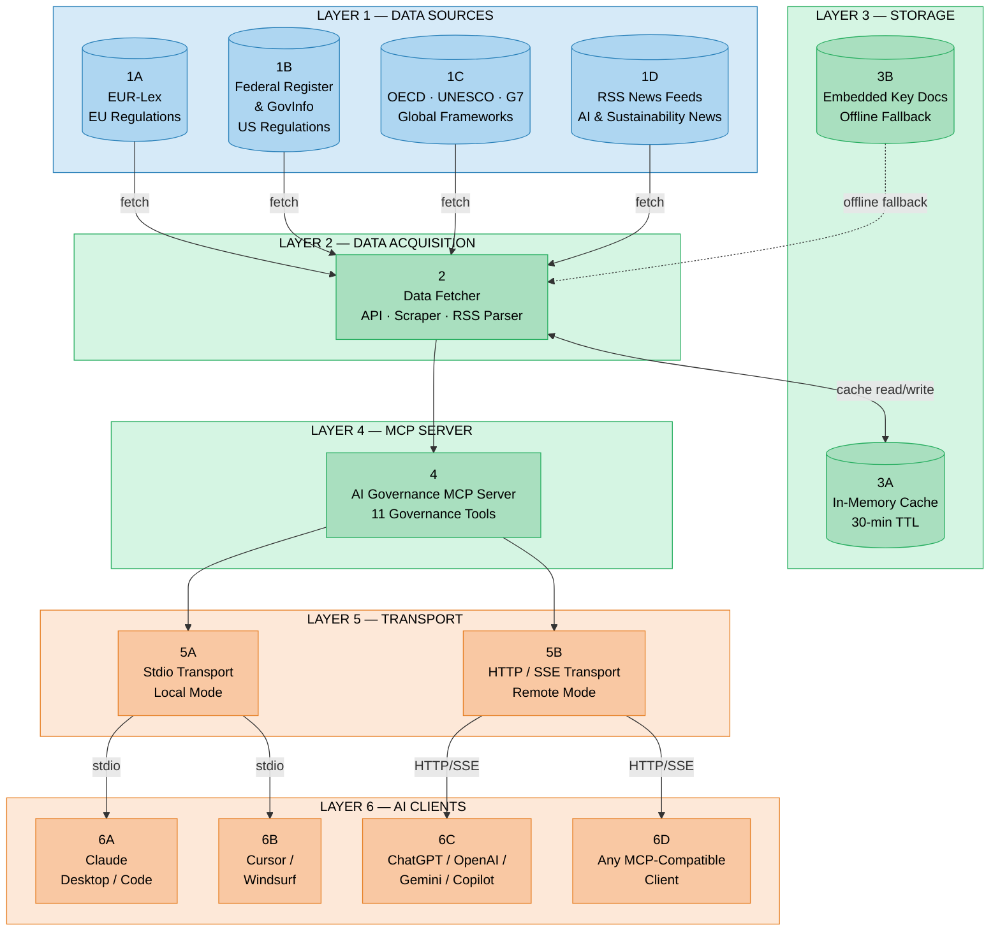

# AI Governance MCP

<p align="center">
  
</p>

<p align="center">
  <a href="https://github.com/Samrajtheailyceum/ai-governance-mcp"></a>
  <a href="https://github.com/Samrajtheailyceum/ai-governance-mcp/blob/main/CHANGELOG.md"></a>
  <a href="https://github.com/Samrajtheailyceum/ai-governance-mcp/blob/main/LICENSE"></a>
  <a href="https://github.com/Samrajtheailyceum/ai-governance-mcp"></a>
</p>

<p align="center">
  
  
  
  
  
  
</p>

A Model Context Protocol (MCP) server that gives any AI assistant real-time access to AI governance laws, regulations, and policy frameworks from around the world.

Compatible with **Claude, ChatGPT, Gemini, Copilot, Cursor, Windsurf**, and any MCP-compatible client. Runs locally (stdio) or as a hosted server (HTTP/SSE).

**GitHub:** `https://github.com/Samrajtheailyceum/ai-governance-mcp`

## Quick Navigation

- [Hosted Server](#use-the-hosted-server-no-setup-needed)
- [Deploy Your Own](#deploy-your-own-one-click)
- [AI Platform Support (with logos)](#ai-platform-support-with-logos)
- [Manual Setup](#manual-setup)
- [Available Tools](#available-tools)
- [Core Regulatory Reference Matrix](#core-regulatory-reference-matrix-restored--expanded)
- [Feedback loop](#feedback-loop)

### Use the Hosted Server (no setup needed)

Connect any MCP-compatible client to the live public server:

```
https://billing-connecting-aquatic-performs.trycloudflare.com/sse
```

Health check: `https://billing-connecting-aquatic-performs.trycloudflare.com/health`

### Deploy Your Own (one click)

[](https://render.com/deploy?repo=https://github.com/Samrajtheailyceum/ai-governance-mcp)

[](https://railway.com/template/new?repo=https://github.com/Samrajtheailyceum/ai-governance-mcp)

After deploying, your server URL will be something like:
```
https://your-app-name.onrender.com/sse
```
Use that URL as your MCP server endpoint on any platform.

---

## Questions / AI Governance Consulting

For any questions or tailored AI governance support, email **hello@theailyceum.com** or visit **https://theailyceum.com**.


## Repository Quality & Governance

## Maintainer GitHub Update Workflow

For maintainers publishing updates to GitHub:

```bash
git add .
git commit -m "Describe your change"
git push origin <branch>
```

If you use this repo with automated agents, ensure each change includes:
- updated docs (when behavior changes),
- test evidence (`npm test`, `npm run test:terminal`),
- a clear PR summary of motivation + implementation + validation.

This repository includes:
- **Contributor workflow:** see [`CONTRIBUTING.md`](CONTRIBUTING.md)
- **Version history:** see [`CHANGELOG.md`](CHANGELOG.md)
- **Operational smoke check:** `npm run test:terminal`

Design goals for this MCP:
1. High-signal governance answers with source links and jurisdiction context
2. Graceful fallback behavior when live endpoints are blocked/rate-limited
3. Practical implementation guidance (not just policy summaries)

## AI Platform Support (with logos)

| Platform | Logo | Typical MCP Mode | Notes |
|----------|------|------------------|-------|
| ChatGPT / OpenAI |  | HTTP/SSE | Use hosted endpoint or `npm run start:sse`. |
| Claude (Desktop / Code) |  | stdio or HTTP/SSE | Great for local stdio integration. |
| Gemini |  | HTTP/SSE | Use the public `/sse` URL for remote connectors. |
| GitHub Copilot |  | HTTP/SSE | Connect as remote MCP endpoint. |
| Cursor |  | stdio | Configure `.cursor/mcp.json`. |
| Windsurf |  | stdio | Configure `mcp_config.json`. |

## One-Click Install: Copy a Prompt Into Your AI Tool

Don't want to configure anything manually? Just **copy the prompt for your platform below** and paste it into your AI assistant. It will handle the installation for you.

### For Claude Code (CLI)

> Paste this into Claude Code:

```
Install the AI Governance MCP server from https://github.com/Samrajtheailyceum/ai-governance-mcp for me.

Steps:
1. Clone the repo: git clone https://github.com/Samrajtheailyceum/ai-governance-mcp.git ~/ai-governance-mcp
2. Run: cd ~/ai-governance-mcp && npm install
3. Add the MCP server: claude mcp add ai-governance node ~/ai-governance-mcp/src/index.js
4. Confirm it's added by running: claude mcp list
```

### For Cursor (with AI chat)

> Paste this into Cursor's AI chat:

```
Help me install the AI Governance MCP server. Here's what to do:

1. Open a terminal and run:
   git clone https://github.com/Samrajtheailyceum/ai-governance-mcp.git ~/ai-governance-mcp
   cd ~/ai-governance-mcp && npm install

2. Then add this to my MCP config file (.cursor/mcp.json):
   {
     "mcpServers": {
       "ai-governance": {
         "command": "node",
         "args": ["~/ai-governance-mcp/src/index.js"]
       }
     }
   }

3. Tell me to restart Cursor to activate it.
```

### For Windsurf (with AI chat)

> Paste this into Windsurf's AI chat:

```
Help me install the AI Governance MCP server. Here's what to do:

1. Open a terminal and run:
   git clone https://github.com/Samrajtheailyceum/ai-governance-mcp.git ~/ai-governance-mcp
   cd ~/ai-governance-mcp && npm install

2. Then add this to my Windsurf MCP config (~/.codeium/windsurf/mcp_config.json):
   {
     "mcpServers": {
       "ai-governance": {
         "command": "node",
         "args": ["~/ai-governance-mcp/src/index.js"]
       }
     }
   }

3. Tell me to restart Windsurf to activate it.
```

### For ChatGPT / OpenAI (needs hosted server)

> Paste this into ChatGPT or any OpenAI-powered tool:

```
I want to connect to the AI Governance MCP server.

The server repo is at: https://github.com/Samrajtheailyceum/ai-governance-mcp

To use it with OpenAI, I need to:
1. Clone and install: git clone https://github.com/Samrajtheailyceum/ai-governance-mcp.git && cd ai-governance-mcp && npm install
2. Start in HTTP/SSE mode: npm run start:sse
3. The server will be available at: http://localhost:3100/sse
4. For production, deploy to Railway/Render and use the public URL as the MCP endpoint.

Help me set this up step by step.
```

### For Claude Desktop (manual config)

> Paste this into Claude Desktop or Claude Code to get help setting it up:

```
Help me add the AI Governance MCP server to my Claude Desktop config.

1. First clone and install:
   git clone https://github.com/Samrajtheailyceum/ai-governance-mcp.git ~/ai-governance-mcp
   cd ~/ai-governance-mcp && npm install

2. Then edit my claude_desktop_config.json and add this to the mcpServers section:
   "ai-governance": {
     "command": "node",
     "args": ["/Users/YOUR_USERNAME/ai-governance-mcp/src/index.js"]
   }

Config location:
- macOS: ~/Library/Application Support/Claude/claude_desktop_config.json
- Windows: %APPDATA%\Claude\claude_desktop_config.json

3. Remind me to restart Claude Desktop after.
```

### For Any Other MCP-Compatible Platform

> Generic prompt you can paste into any AI assistant:

```
I want to install the AI Governance MCP server from https://github.com/Samrajtheailyceum/ai-governance-mcp

It's a standard MCP server that runs over stdio (default) or HTTP/SSE (with PORT env var).

Please help me:
1. Clone the repo and run npm install
2. Configure it for whatever MCP client/platform I'm using
3. The entry point is src/index.js
4. For HTTP/SSE mode, run with PORT=3100 and connect to http://localhost:3100/sse
```

---

## Manual Setup

### Prerequisites

- **Node.js 18+** (check with `node --version`)
- **npm** (comes with Node)
- **git** (to clone the repo)

### Step 1: Clone and Install

```bash
git clone https://github.com/Samrajtheailyceum/ai-governance-mcp.git
cd ai-governance-mcp
npm install
```

### Step 2: Verify It Works

```bash
# Run the test suite (hits live APIs — needs internet)
npm test

# Quick health check in HTTP mode
PORT=3100 node src/index.js &
curl http://localhost:3100/health
# Should return: {"status":"ok","server":"ai-governance-mcp","version":"2.0.0"}
kill %1

# One-command terminal smoke test (starts server, checks /health, validates version)
npm run test:terminal
```

### OpenAI / ChatGPT Terminal Test Flow

If you are testing from an OpenAI-compatible terminal workflow, use this minimal sequence:

```bash
# 1) Install + baseline tests
npm install
npm test

# 2) Start server in SSE mode for MCP clients
npm run start:sse
# endpoint: http://localhost:3100/sse
# health:   http://localhost:3100/health
```

Then in your MCP client, run prompts like:
- `search_ai_governance` with `query="foundation model transparency requirements"`
- `get_latest_ai_governance_updates` with `region="all"`
- `get_applied_ai_governance_frameworks` with `use_case="AI hiring assistant for EU market"`

If live sources are blocked/rate-limited, the server now returns a limits-aware response with trusted generic regulatory URLs so users still get actionable resources.

### Step 3: Choose Your Mode

**Option A: Local (stdio)** — for Claude Desktop, Claude Code, Cursor, Windsurf

```bash
npm start
# Server runs on stdin/stdout — connect via your platform's MCP config
```

Then add to your platform's config (see [Platform Config Reference](#platform-config-reference) below).

**Option B: Remote (HTTP/SSE)** — for OpenAI, ChatGPT, platform connectors, team use

```bash
npm run start:sse
# Server runs on http://localhost:3100
```

Server URL: `http://localhost:3100/sse`
Health check: `http://localhost:3100/health`

**Option C: Docker**

```bash
docker build -t ai-governance-mcp .
docker run -p 3100:3100 ai-governance-mcp
```

Server URL: `http://localhost:3100/sse`

Deploy to any hosting provider (Railway, Render, Fly.io, etc.) and use that URL instead.

---

## Environment Variables

| Variable | Default | Description |
|----------|---------|-------------|
| `PORT` | *(none)* | Set to enable HTTP/SSE mode (e.g. `3100`). When unset, server runs in stdio mode. |
| `NODE_ENV` | `development` | Set to `production` for deployed instances. |

**Examples:**

```bash
# stdio mode (default — no PORT set)
node src/index.js

# HTTP/SSE mode on port 3100
PORT=3100 node src/index.js

# Custom port
PORT=8080 node src/index.js
```

---

## npm Scripts

| Script | Command | What It Does |
|--------|---------|-------------|
| `npm start` | `node src/index.js` | Start in stdio mode (for MCP clients) |
| `npm run start:sse` | `PORT=3100 node src/index.js` | Start in HTTP/SSE mode on port 3100 |
| `npm test` | `node test/client.js` | Run the full test suite against live APIs |
| `npm run test:terminal` | `bash scripts/terminal-smoke.sh` | Start server and validate `/health` + `version` in one command |

---

## Platform Config Reference

### Claude Desktop

Add to your `claude_desktop_config.json`:

```json
{
  "mcpServers": {
    "ai-governance": {
      "command": "node",
      "args": ["/absolute/path/to/ai-governance-mcp/src/index.js"]
    }
  }
}
```

Config file locations:
- **macOS:** `~/Library/Application Support/Claude/claude_desktop_config.json`
- **Windows:** `%APPDATA%\Claude\claude_desktop_config.json`

**Important:** Restart Claude Desktop after editing the config.

### Claude Code (CLI)

```bash
claude mcp add ai-governance node /absolute/path/to/ai-governance-mcp/src/index.js
```

### Cursor

Add to `.cursor/mcp.json` (project) or `~/.cursor/mcp.json` (global):

```json
{
  "mcpServers": {
    "ai-governance": {
      "command": "node",
      "args": ["/absolute/path/to/ai-governance-mcp/src/index.js"]
    }
  }
}
```

### Windsurf

Add to `~/.codeium/windsurf/mcp_config.json`:

```json
{
  "mcpServers": {
    "ai-governance": {
      "command": "node",
      "args": ["/absolute/path/to/ai-governance-mcp/src/index.js"]
    }
  }
}
```

### OpenAI / ChatGPT / Assistants API

Start the server in HTTP/SSE mode:

```bash
npm run start:sse
# or: PORT=3100 node src/index.js
```

MCP server endpoint:
```
http://localhost:3100/sse
```

For production, deploy the server and use the deployed URL.

### Any MCP-Compatible Client

**stdio mode** (default):
```bash
node /absolute/path/to/ai-governance-mcp/src/index.js
```

**HTTP/SSE mode**:
```bash
PORT=3100 node /absolute/path/to/ai-governance-mcp/src/index.js
```
Connect to `http://localhost:3100/sse` using the MCP SSE transport.

---

## Available Tools

| Tool | Description |
|------|-------------|
| `search_ai_governance` | Full-text search across all databases, with `focus` support for sustainability |
| `get_latest_ai_governance_updates` | Latest updates from RSS feeds, with automatic non-RSS fallback |
| `get_sustainability_ai_regulatory_briefing` | Sustainability-focused AI and disclosure regulation briefing |
| `get_applied_ai_governance_frameworks` | Applies real frameworks to a use case with context, implementation checklist, and links |
| `get_key_ai_governance_documents` | Curated list of landmark documents |
| `get_eu_ai_act_info` | EU AI Act deep dive with topic search |
| `get_us_ai_policy` | US policy landscape with Federal Register search |
| `get_global_ai_frameworks` | OECD, G7, UN, UNESCO, Bletchley and more |
| `fetch_governance_document` | Fetch and extract text from any document URL |
| `compare_ai_governance_frameworks` | Side-by-side comparison on a specific topic |
| `submit_mcp_feedback` | Capture structured user feedback (rating + message) for maintainers; logs to `logs/mcp-feedback.jsonl` |

Most user-facing tools now include a **Response Protocol (Professional)** preface so downstream LLMs use the retrieved context correctly and state assumptions/uncertainty explicitly.

If live sources are unavailable or a question is out-of-scope for current retrievable data, the MCP now returns a clear **limitations notice** plus trusted **generic resource URLs** (OECD, EUR-Lex, Federal Register, NIST, UNESCO, IFRS) so users still get actionable next steps.

## Data Sources

| Region | Source | What's Covered |
|--------|--------|----------------|
| EU | EUR-Lex API + RSS | EU AI Act, GDPR, CSRD, CSDDD, AI regulations |
| US | Federal Register API, GovInfo | Executive orders, federal agency rules, AI bills, climate disclosure activity |
| Global | OECD, G7, UNESCO, UN, ISSB | International frameworks and principles |
| News | Stanford HAI, AI Now, FLI, ESG Today | Research, policy, and sustainability news |

## Core Regulatory Reference Matrix (restored + expanded)

| Reference | Region | Why it matters | Link |
|-----------|--------|----------------|------|
| EU AI Act (2024/1689) | EU | Binding AI risk obligations, GPAI duties, penalties | https://eur-lex.europa.eu/legal-content/EN/TXT/?uri=CELEX:32024R1689 |
| GDPR | EU | Data protection/legal basis controls for AI systems | https://eur-lex.europa.eu/legal-content/EN/TXT/?uri=CELEX:32016R0679 |
| CSRD | EU | Sustainability reporting obligations and governance evidence expectations | https://eur-lex.europa.eu/legal-content/EN/TXT/?uri=CELEX:32022L2464 |
| CSDDD | EU | Supply-chain due diligence duties relevant to AI-enabled operations | https://eur-lex.europa.eu/legal-content/EN/TXT/?uri=CELEX:32024L1760 |
| EO 14179 (2025) | US | Current federal executive direction for AI policy | https://www.federalregister.gov/documents/2025/01/23/2025-01953/removing-barriers-to-american-leadership-in-artificial-intelligence |
| NIST AI RMF 1.0 | US | Practical governance lifecycle (Govern, Map, Measure, Manage) | https://airc.nist.gov/RMF |
| SEC Climate Rule | US | Climate-related disclosure governance and controls context | https://www.sec.gov/rules-regulations/2024/03/enhancement-standardization-climate-related-disclosures-investors |
| OECD AI Principles | Global | International baseline principles adopted across countries | https://oecd.ai/en/ai-principles |
| UNESCO AI Ethics Recommendation | Global | Human-rights and ethics guardrails for AI policy and deployment | https://unesdoc.unesco.org/ark:/48223/pf0000381137 |
| ISSB IFRS S1/S2 | Global | Sustainability disclosure standards used in cross-border governance | https://www.ifrs.org/issued-standards/ifrs-sustainability-standards-navigator/ |

## Example Prompts

Once connected to any AI assistant, you can ask:

- *"What are the latest AI governance updates from the EU?"*
- *"Search for AI liability regulations"*
- *"Compare how the EU and US handle foundation model requirements"*
- *"Give me a summary of the EU AI Act's prohibited practices"*
- *"Fetch the NIST AI Risk Management Framework"*
- *"What US executive orders on AI are currently active?"*

## Feedback loop

The MCP can collect user feedback through `submit_mcp_feedback` (rating + context + message).
This helps maintainers improve future versions, but does **not** auto-train the model in real-time.

## Testing

```bash
# Full test suite — tests v2.0 data fetchers against live APIs
npm test
```

The test suite checks:
1. Source configuration (key docs, RSS feeds, regions)
2. Key document retrieval (EU, US, Global)
3. Federal Register API search
4. EUR-Lex search
5. RSS feed aggregation
6. Global combined search (all sources)
7. Document content fetching (scrapes a live URL)
8. Global framework ranking and retrieval quality
9. A 20-prompt reliability sweep across sustainability + AI governance topics
10. Applied framework guidance includes context, implementation steps, and resource links

Tests require internet access. Some may show warnings if external APIs are temporarily unavailable — this is normal, the server has built-in fallbacks.

---

## Architecture

```
ai-governance-mcp/
├── src/
│   ├── index.js      — MCP server (stdio + HTTP/SSE), all v2.0 tool definitions
│   ├── fetcher.js    — Data fetching (EUR-Lex, Fed Register, RSS, web scraping)
│   └── sources.js    — Source config (API URLs, key documents, RSS feeds)
├── test/
│   └── client.js     — End-to-end test suite
├── Dockerfile         — Docker deployment config
├── render.yaml        — Render.com one-click deploy config
└── package.json       — Dependencies and scripts
```

### System Architecture Diagram (L1 — System Context)



### How It Works

1. **Client connects** via stdio (local) or SSE (remote)
2. **Client calls a tool** (e.g. `search_ai_governance` with query "AI liability")
3. **Server fetches data** from EUR-Lex, Federal Register, GovInfo, or RSS feeds
4. **Results are cached** in-memory for 30 minutes (avoids rate limits, speeds up repeat queries)
5. **Server returns** formatted markdown results to the client

### Caching

All API responses are cached in-memory for 30 minutes. The cache is per-process — restarting the server clears the cache. No external cache (Redis, etc.) is needed.

---

## Adding New Sources

1. **Add the source config** in `src/sources.js`:

```javascript
// In SOURCES object
myNewSource: {
  name: "My Source Name",
  region: "EU",           // or "US", "Global"
  baseUrl: "https://api.example.com",
  rssFeeds: [
    { label: "My Feed", url: "https://example.com/feed.xml" }
  ],
  keyDocs: [
    {
      id: "doc-1",
      title: "Important Document",
      url: "https://example.com/doc",
      date: "2024-01-01",
      status: "Active",
      type: "Regulation"
    }
  ]
}
```

2. **Add fetch logic** in `src/fetcher.js`:

```javascript
export async function searchMySource(query, maxResults = 10) {
  const cacheKey = `mysource:${query}:${maxResults}`;
  const cached = getCached(cacheKey);
  if (cached) return cached;

  // Fetch from API, parse results, return array of { title, url, date, summary, source, region }

  setCached(cacheKey, results);
  return results;
}
```

3. **Wire it into `globalSearch`** in `src/fetcher.js` to include in combined search results.

4. **Optionally add a dedicated tool** in `src/index.js` using `server.tool(...)`.

---

## Troubleshooting

### "Cannot find module" or npm install fails

```bash
# Make sure you're in the project directory
cd ai-governance-mcp

# Clear and reinstall
rm -rf node_modules package-lock.json
npm install
```

### Server starts but tools return empty results

The server fetches live data from external APIs (EUR-Lex, Federal Register, etc.). Check:
- You have internet access
- The APIs aren't temporarily down (the server has fallback caches for key documents)
- Run `npm test` to see which sources are responding

### Claude Desktop doesn't show the MCP tools

1. Make sure the **absolute path** in `claude_desktop_config.json` is correct (no `~` — use full path)
2. **Restart Claude Desktop** after editing the config
3. Check the path works: `node /your/absolute/path/to/ai-governance-mcp/src/index.js` — should print "AI Governance MCP Server running on stdio" to stderr

### Port already in use (HTTP/SSE mode)

```bash
# Find what's using the port
lsof -i :3100

# Kill it
kill -9 <PID>

# Or use a different port
PORT=3200 node src/index.js
```

### CORS errors when connecting from a browser-based client

The server includes CORS headers that allow all origins (`*`). If you're behind a reverse proxy, make sure the proxy forwards the CORS headers.

### Docker build fails

```bash
# Make sure Docker is running, then:
docker build --no-cache -t ai-governance-mcp .
```

---

## Contributing

Contributions welcome! Here's how:

1. **Fork** the repo
2. **Create a branch** (`git checkout -b feature/my-new-source`)
3. **Make your changes** — add sources in `sources.js`, fetch logic in `fetcher.js`, tools in `index.js`
4. **Test** (`npm test`)
5. **Open a PR** with a clear description of what you added

**Ideas for contributions:**
- New data sources (UK, China, Canada, Brazil, Singapore AI regulations)
- Additional comparison topics in `compare_ai_governance_frameworks`
- Structured data extraction (JSON output for specific regulations)
- Webhook/notification support for new regulation alerts
- Authentication support for premium data APIs

---

## Frequently Asked Questions

**Q: Does this cost anything?**
A: No. The server is free and open source. All data sources (EUR-Lex, Federal Register, OECD, RSS feeds) are free public APIs.

**Q: How current is the data?**
A: Live. Every query hits the actual APIs in real-time (with 30-minute caching). RSS feeds pull the latest published items. Key documents are updated in source code as new landmark regulations are published.

**Q: Can I use this commercially?**
A: Yes. MIT license. The data comes from public government sources.

**Q: Does it work offline?**
A: Partially. Key documents (EU AI Act, NIST RMF, etc.) are cached in source code and always available. Live search and RSS feeds require internet.

**Q: How do I add my own country's regulations?**
A: See [Adding New Sources](#adding-new-sources) above. Add the API/RSS config to `sources.js` and the fetch logic to `fetcher.js`.

---

## License

MIT
